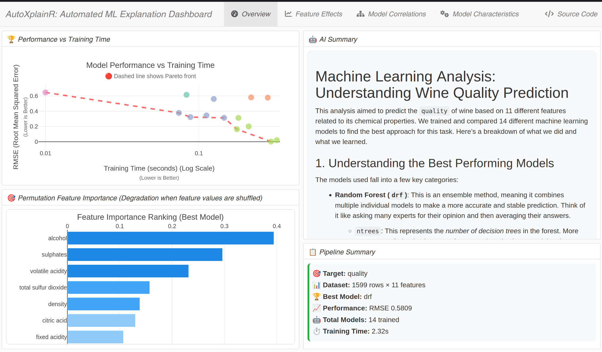
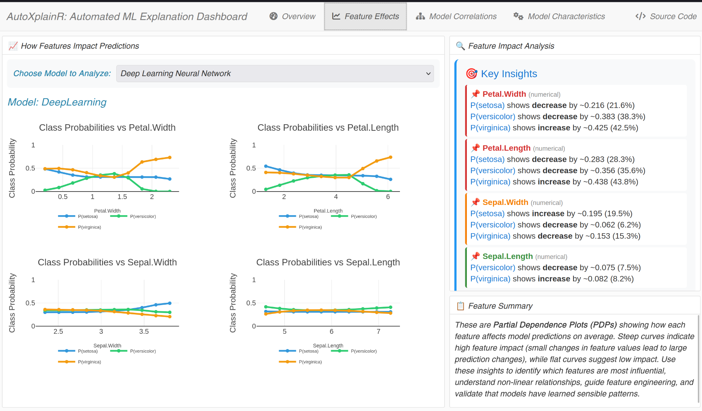
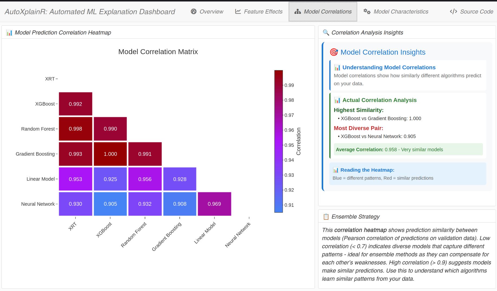
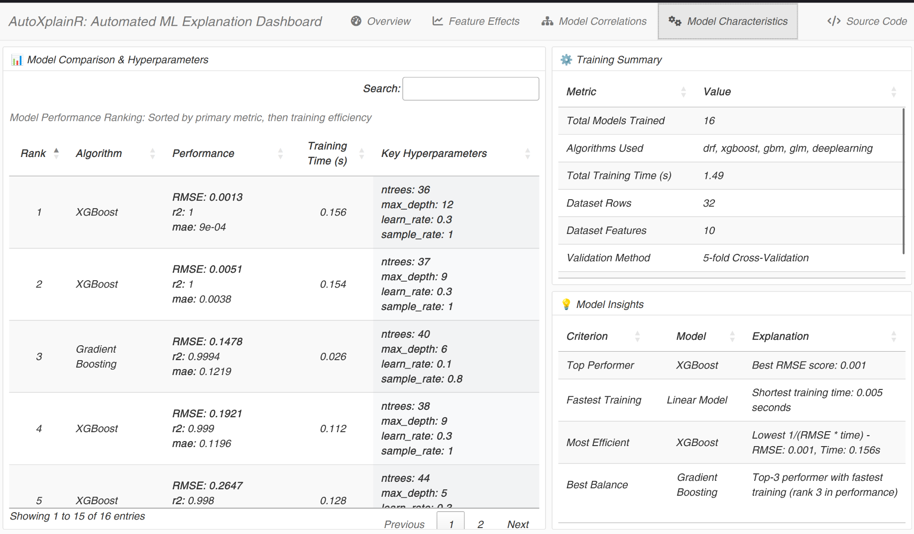

# AutoXplainR

[](https://www.r-project.org/)
[](https://opensource.org/licenses/MIT)
[](https://lifecycle.r-lib.org/articles/stages.html#experimental)

An R package for automated machine learning explanation and comparative reporting. AutoXplainR provides an efficient, automated, and standardized method for generating comparative model explanations from AutoML outputs with clear reports suitable for diverse audiences.

🔗 **Repository**: [https://github.com/Matt17BR/AutoXplainR](https://github.com/Matt17BR/AutoXplainR)

## 📊 Dashboard Preview

AutoXplainR generates comprehensive interactive dashboards that make machine learning models interpretable and actionable:

<div align="center">
  
  <p><em>Main dashboard showing model performance overview and key insights</em></p>
</div>

## ✨ Key Features

- 🤖 **Automated ML Pipeline**: Seamless integration with H2O AutoML
- 🔍 **Custom Explanations**: Permutation importance and partial dependence plots implemented from scratch
- 📊 **Interactive Visualizations**: Custom plotly-based plots for all explanation types
- 🔬 **Comparative Analysis**: Side-by-side model comparison and explanation
- 🧠 **Natural Language Reports**: LLM-generated summaries using Google Generative AI
- 📈 **HTML Dashboards**: Comprehensive interactive dashboards using flexdashboard
- 🎯 **Self-Reliant**: No dependencies on existing XAI packages like DALEX or iml

## Installation

### Prerequisites

Ensure you have the required dependencies installed:

```r
# Install devtools if not already installed
if (!require(devtools)) install.packages("devtools")

# H2O installation (if not already installed)
if (!require(h2o)) {
  install.packages("h2o")
}
```

### From GitHub

```r
# Install from GitHub
devtools::install_github("Matt17BR/AutoXplainR")

# Load the package
library(AutoXplainR)
```

## Configuration

### Google Generative AI Setup
Set your API key for natural language report generation:

```r
# Set environment variable
Sys.setenv(GEMINI_API_KEY = "your_api_key_here")

# Or pass directly to function
generate_natural_language_report(result, api_key = "your_api_key_here")
```

## Quick Start

```r
# Basic usage
data(mtcars)
result <- autoxplain(mtcars, "mpg", max_models = 10, max_runtime_secs = 120)

# Generate comprehensive dashboard
generate_dashboard(result, "my_dashboard.html")
```

## Core Functions

### AutoML Integration
- `autoxplain()`: Main function for automated ML with explanation pipeline

### Explanation Methods
- `calculate_permutation_importance()`: Feature importance via permutation
- `calculate_partial_dependence()`: Partial dependence for single features
- `calculate_partial_dependence_multi()`: Partial dependence for multiple features

<div align="center">
  
  <p><em>Interactive partial dependence plots showing feature effects on predictions</em></p>
</div>

### Visualization
- `plot_permutation_importance()`: Interactive importance bar charts
- `plot_partial_dependence()`: Interactive PDP line plots
- `plot_partial_dependence_multi()`: Multi-feature PDP subplots
- `plot_model_comparison()`: Model performance scatter plots

<div align="center">
  
  <p><em>Model correlation analysis revealing ensemble diversity and prediction agreement</em></p>
</div>

### Dashboard & Reporting
- `generate_dashboard()`: Comprehensive HTML dashboard with flexdashboard
- `create_simple_dashboard()`: Lightweight HTML dashboard
- `generate_natural_language_report()`: LLM-powered report generation

<div align="center">
  
  <p><em>Detailed model characteristics and performance metrics for informed model selection</em></p>
</div>

## Example Workflow

```r
library(AutoXplainR)

# 1. Run AutoML
data(mtcars)
result <- autoxplain(mtcars, "mpg", max_models = 3, max_runtime_secs = 180)

# 2. Generate explanations for best model
model <- result$models[[1]]
importance <- calculate_permutation_importance(model, mtcars, "mpg")
top_features <- head(importance$feature, 3)
pdp_data <- calculate_partial_dependence_multi(model, mtcars, top_features)

# 3. Generate explanations for a specific model or variables
importance <- calculate_permutation_importance(result$models[[1]], mtcars, "mpg")
pdp_data <- calculate_partial_dependence_multi(result$models[[1]], mtcars, c("wt", "hp"))

# 4. Generate comprehensive dashboard
generate_dashboard(
  result, 
  output_file = "mtcars_analysis.html",
  top_features = 5,
  sample_instances = 3,
  include_llm_report = TRUE
)

# 5. Create individual plots
plot_model_comparison(result)
plot_permutation_importance(importance)
plot_partial_dependence_multi(pdp_data)
```

## Architecture

AutoXplainR follows a modular architecture:

1. **AutoML Engine**: H2O AutoML integration for model training
2. **Explanation Engine**: Custom implementations of:
   - Permutation feature importance
   - Partial dependence plots
3. **Visualization Engine**: Interactive plotly-based charts
4. **Reporting Engine**: Dashboard generation and LLM integration
5. **Testing Suite**: Comprehensive test coverage

## 🖼️ Visual Gallery

<div align="center">
  <table>
    <tr>
      <td align="center">
        <br>
        <strong>📊 Dashboard Overview</strong><br>
        <em>Performance metrics & insights</em>
      </td>
      <td align="center">
        <br>
        <strong>📈 Feature Effects</strong><br>
        <em>Partial dependence analysis</em>
      </td>
    </tr>
    <tr>
      <td align="center">
        <br>
        <strong>🔗 Model Correlations</strong><br>
        <em>Ensemble diversity analysis</em>
      </td>
      <td align="center">
        <br>
        <strong>🎯 Model Details</strong><br>
        <em>Performance & characteristics</em>
      </td>
    </tr>
  </table>
</div>

## Dependencies

### Required
- h2o (>= 3.40.0)
- plotly (>= 4.10.0) 
- data.table (>= 1.14.0)
- jsonlite (>= 1.8.0)
- httr (>= 1.4.0)
- stringr (>= 1.4.0)

### Suggested
- flexdashboard (>= 0.6.0)
- rmarkdown (>= 2.0.0)
- DT (>= 0.20.0)
- testthat (>= 3.0.0)


## License

MIT License - see [LICENSE](LICENSE) file for details.

