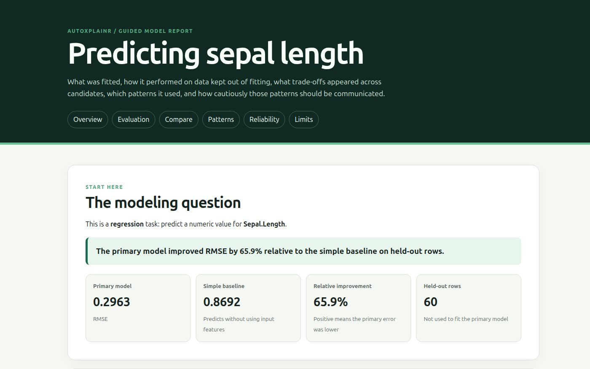
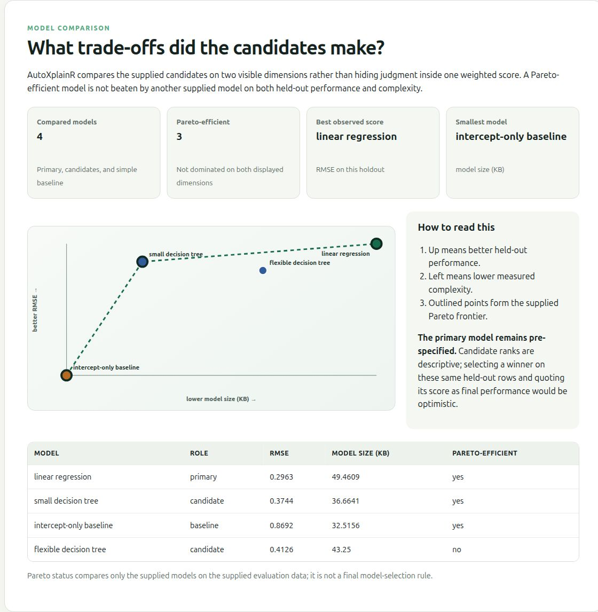
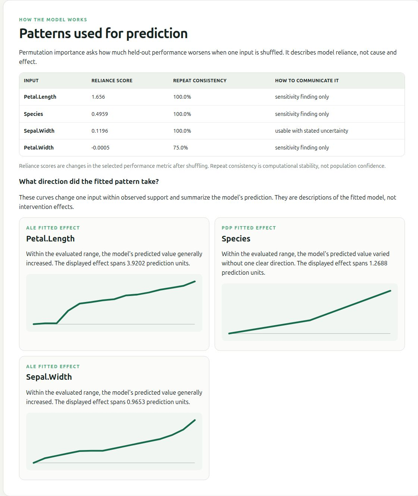
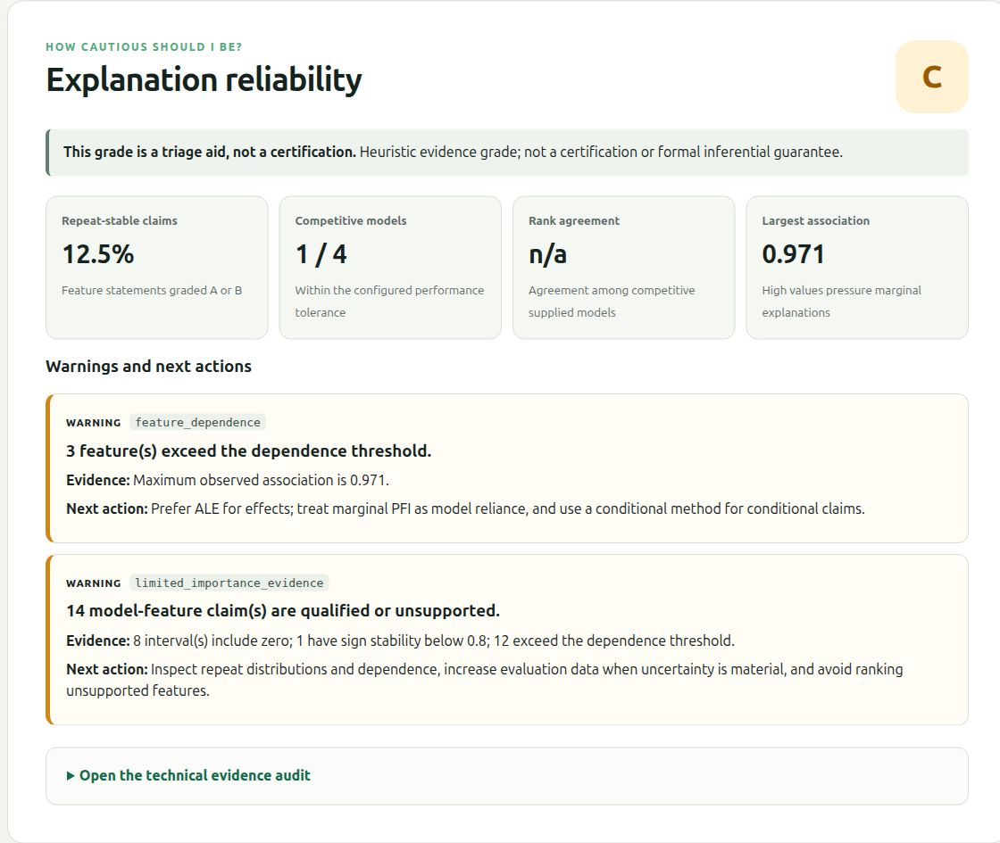

# AutoXplainR

[](https://github.com/Matt17BR/autoXplainR/actions/workflows/R-CMD-check.yaml)
[](https://github.com/Matt17BR/autoXplainR/actions/workflows/test-coverage.yaml)
[](https://matt17br.github.io/autoXplainR/)
[](https://lifecycle.r-lib.org/articles/stages.html)
[](LICENSE.md)

**Fit. Check. Compare. Understand. Explain.**

AutoXplainR helps someone fitting one of their first tabular models move from a
data frame to a responsible, shareable explanation. It creates a held-out test
set, compares an understandable model with a simple baseline, defines every
metric, investigates fitted patterns, and tells the user what the evidence does
and does not support.

The default path is local and needs no Java, cloud account, or LLM. A comparison
mode adds multiple approachable candidates and Pareto trade-offs. Advanced
users can bring any fitted model, use H2O AutoML, or opt into local or hosted
language models.

**[Get started](https://matt17br.github.io/autoXplainR/articles/autoxplainr-introduction.html)** ·
**[Function reference](https://matt17br.github.io/autoXplainR/reference/index.html)** ·
**[Product contract](PRODUCT.md)** · **[Roadmap](ROADMAP.md)**

<p align="center">
  
  <br><sub>A complete first screen: the question, unseen-data result, baseline, and evaluation size. No scrolling inside the image.</sub>
</p>

## Start with one call

```r
library(AutoXplainR)

result <- autoxplain(mtcars, target_column = "mpg", seed = 2026)
result
render_model_report(result, "my-model-report.html")
```

The default call fits two deliberately understandable references:

- a linear, logistic, or multinomial logistic primary model; and
- an intercept-only baseline that ignores every input.

Both are evaluated on rows kept out of fitting. The printed result answers the
first useful question—*did the model improve on a simple guess?*—before the
package asks anyone to interpret feature importance.

```text
<AutoXplainR guided result>
  question:   predict `mpg` (regression)
  engine:     base
  models:     2 (primary + baseline)
  result:     primary model has rmse = ...
  baseline:   ...% improvement in rmse
```

## Compare models without hiding the trade-off

Comparison is not out of scope. It is a first-class, opt-in extension of the
same beginner workflow:

```r
comparison <- autoxplain(
  iris,
  target_column = "Sepal.Length",
  model_set = "comparison",
  test_fraction = 0.4,
  seed = 2026
)

model_tradeoffs(comparison)
plot_model_comparison(comparison)  # optional interactive Plotly view
render_model_report(comparison, "comparison-report.html")
```

The local comparison set contains the pre-specified statistical model, a small
decision tree, a more flexible tree, and the simple baseline. AutoXplainR shows
held-out performance, fit and prediction time, model size, complexity, and the
candidate-relative Pareto frontier.

It does **not** collapse those dimensions into a mysterious score. It also does
not silently replace the primary model with whichever candidate happened to
win on the holdout: doing that and then reporting the same holdout score as
final performance would be optimistic.

<p align="center">
  
  <br><sub>Performance versus model size, with the interpretation rule and full candidate table kept in the frame.</sub>
</p>

## One report, from result to responsible language

| Question | What AutoXplainR provides |
|---|---|
| What am I predicting? | detected task, target, split, preprocessing, and fitted family |
| Does the model work? | held-out metrics, plain definitions, baseline comparison, probability calibration, optional subgroup checks, and failure warnings |
| Are other models competitive? | explicit candidates, prediction comparisons, and Pareto trade-offs |
| What patterns does it use? | repeated permutation reliance plus ALE or diagnosed PDP effects |
| How much should I trust the explanation? | dependence, repeat stability, supplied-model disagreement, and next actions |
| How do I communicate it? | a deterministic local narrative, optional LLM adapter, and standalone HTML |

<table>
  <tr>
    <td width="50%" valign="top">
      <br>
      <strong>Explain fitted patterns</strong><br>
      <sub>Reliance and effect direction, with causal boundaries adjacent to the result.</sub>
    </td>
    <td width="50%" valign="top">
      <br>
      <strong>Stress-test the explanation</strong><br>
      <sub>A diagnostic grade, evidence, and concrete next actions—not a certification.</sub>
    </td>
  </tr>
</table>

Every screenshot above is a crop of the package's dependency-free HTML report,
not a separate design mock-up. The report remains readable after it is shared;
it does not require R, H2O, Plotly, or an LLM at viewing time.

## Open the analysis when you need more control

The guided result converts into ordinary model-agnostic explainers:

```r
explainer <- as_explainers(result, models = "main_model")$main_model

importance <- calculate_permutation_importance(
  explainer,
  n_repeats = 30,
  seed = 2026
)

effect <- explain_effect(explainer, feature = "wt")
```

Permutation intervals describe variation across random shuffles; they are not
population confidence intervals. ALE and PDP describe the fitted prediction
function; they do not establish the effect of intervening on an input.

For a multi-model reliability review:

```r
audit <- audit_explanations(
  as_explainers(comparison),
  n_repeats = 30,
  performance_tolerance = 0.05,
  seed = 2026
)

audit
render_explanation_report(audit, "technical-evidence.html")
```

The audit retains repeat-level importance, feature-dependence diagnostics,
near-optimal supplied models, prediction agreement, explanation disagreement,
and explicit permitted-claim labels.

## A complete explanation never requires an LLM

The deterministic local narrative is always the default—even if an API key is
present:

```r
memo <- generate_natural_language_report(result)
render_model_report(result, "report.html", narrative = memo)
```

Remote generation requires an explicit provider. Only aggregate metrics,
feature names, warnings, and provenance enter the prompt; raw rows, fitted
objects, case-level predictions, and secrets do not.

```r
narrative_providers()

memo <- generate_natural_language_report(result, provider = "gemini")
memo <- generate_natural_language_report(result, provider = "groq")
memo <- generate_natural_language_report(result, provider = "ollama")
memo <- generate_natural_language_report(result, provider = "openrouter")
```

Current defaults are documented against the official [Gemini free-tier
pricing](https://ai.google.dev/gemini-api/docs/pricing), [Groq rate
limits](https://console.groq.com/docs/rate-limits), [Ollama local
API](https://docs.ollama.com/api/openai-compatibility), and [OpenRouter free
routing](https://openrouter.ai/docs/guides/routing/model-variants/free).
Provider, resolved model, fallback, and prompt provenance are retained.

## Classification, existing models, and H2O use the same contract

```r
# Multiclass classification
flowers <- autoxplain(iris, target_column = "Species", seed = 2026)

# Any existing model or framework
existing <- explain_model(
  fitted_object,
  data = held_out_data,
  y = "outcome",
  task = "binary",
  positive = "yes",
  predict_function = function(model, newdata) {
    # Return P(outcome == "yes") as a numeric vector.
  }
)

# Broader optional AutoML candidate set; requires Java and h2o
h2o_result <- autoxplain(
  training_data,
  target_column = "outcome",
  test_data = held_out_data,
  engine = "h2o",
  max_models = 10,
  seed = 2026
)
```

Regression predictions are numeric vectors. Binary predictions are
positive-class probabilities. Multiclass predictions are named probability
matrices. The package validates that contract before an expensive explanation
begins.

## Installation

AutoXplainR is under active development and is not yet on CRAN.

```r
# install.packages("pak")
pak::pak("Matt17BR/autoXplainR")
```

## Interpretation boundaries

- Held-out performance describes the supplied evaluation data, not every future
  population or time period.
- A Pareto frontier covers only the supplied models and displayed objectives.
- Permutation importance estimates fitted-model reliance and is sensitive to
  dependent predictors.
- ALE reduces direct marginal extrapolation but remains associational.
- Generated prose can be wrong; the numerical report remains authoritative.
- AutoXplainR does not automate causal claims, fairness certification, safety
  approval, or deployment decisions.

## Where it fits

AutoXplainR complements modeling and explanation frameworks rather than hiding
them. [DALEX](https://jmlr.org/papers/v19/18-416.html), ingredients, and iml
provide broad explanation ecosystems; [xplainfi](https://mlr-org.github.io/xplainfi/articles/inference.html)
provides formal importance-inference tools; tidymodels, mlr3, and H2O provide
larger modeling systems. AutoXplainR's role is the approachable contract joining
fit, unseen-data evaluation, comparison, explanation reliability, and careful
communication.

The methods are grounded in Fisher, Rudin, and Dominici's
[model-class-reliance work](https://www.jmlr.org/papers/v20/18-760.html), Apley
and Zhu's [ALE method](https://arxiv.org/abs/1612.08468), and Biecek's
[DALEX framework](https://jmlr.org/papers/v19/18-416.html).

## Development and governance

```r
devtools::document()
devtools::test()
devtools::check()
```

The ordinary suite is dependency-light. Real H2O integration is isolated and
opt-in:

```sh
AUTOXPLAIN_RUN_H2O=true Rscript -e 'devtools::test(filter = "h2o")'
```

See the [contribution guide](CONTRIBUTING.md), [security policy](SECURITY.md),
[governance](GOVERNANCE.md), [release checklist](.github/RELEASE_CHECKLIST.md),
and [release notes](NEWS.md). Questions and early ideas belong in
[GitHub Discussions](https://github.com/Matt17BR/autoXplainR/discussions).

## License

[MIT](LICENSE.md) © 2025–2026 Matteo Mazzarelli.
