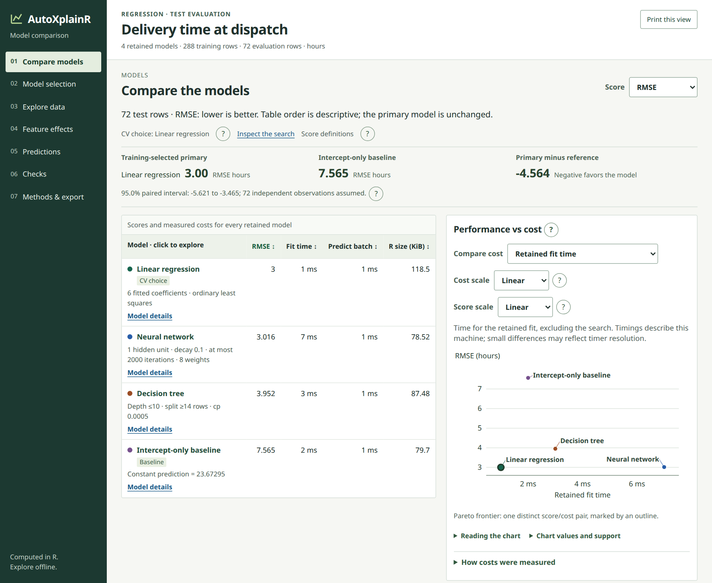
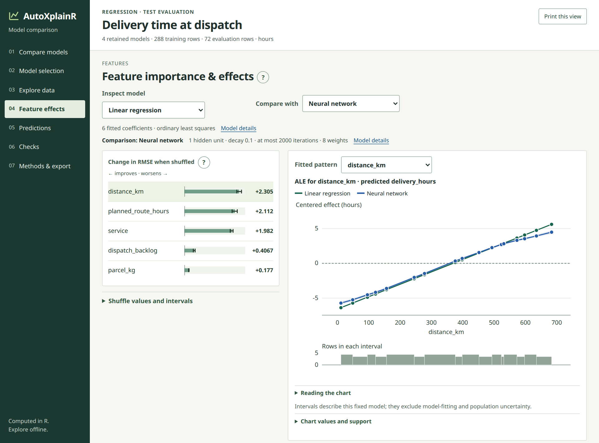
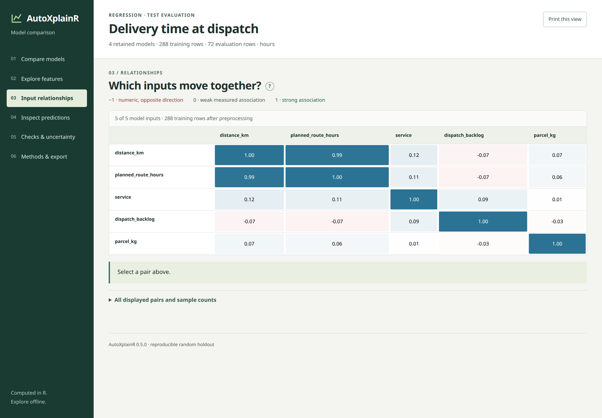
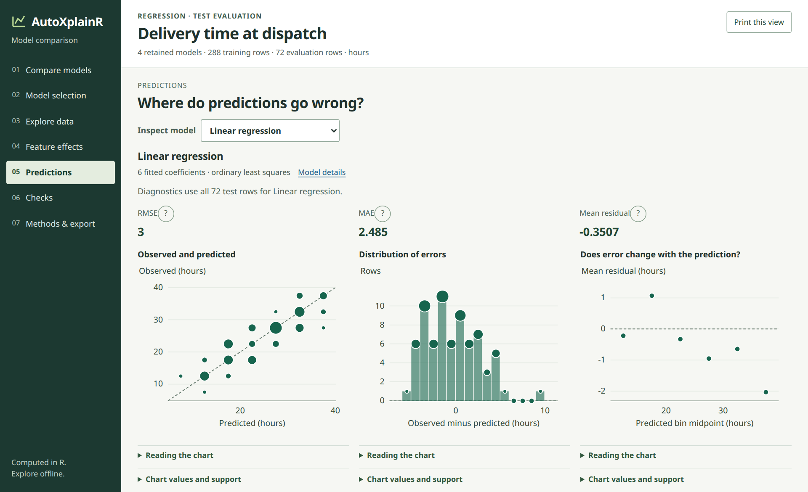

# AutoXplainR

Fit several models, compare their predictions and costs, and explore what each
one learned—with one R command.

[](https://matt17br.github.io/autoXplainR/model-report.html)

*Start with the models: how well do they predict, and what do they cost?
Preview uses synthetic data.
[Open the example report](https://matt17br.github.io/autoXplainR/model-report.html).*

## Try it

```r
# install.packages("pak")
pak::pak("Matt17BR/autoXplainR")

library(AutoXplainR)
result <- autoxplain(mtcars, "mpg", report = "model-report.html")
result
```

This searches 15 settings across linear, tree and neural models using five
training-only cross-validation folds. It keeps one fitted representative per
successful family plus a baseline, evaluates them on a reproducible 20% holdout,
and writes a standalone report with importance and fitted effects. Regression,
binary classification and multiclass classification use the same command.

The default runs locally without Java, an API key or a language model. For a
fast reference model and baseline, set `model_set = "quick"`. AutoXplainR is
available on GitHub; it is not yet on CRAN.

`mtcars` is a small teaching example, not evidence that a model is ready for use.
For your own analysis, choose predictors that are available when a prediction
will be made. Exclude arbitrary identifiers and columns measured after the
outcome. The [first-report tutorial](https://matt17br.github.io/autoXplainR/articles/autoxplainr-introduction.html)
shows missing values, novel categories, an explicit split and recipe inspection.
Numeric outcomes with exactly two values are treated as binary classification;
use `task = "regression"` to override that choice. Binary probabilities refer to
the **second outcome factor level**. For `factor(outcome, levels = c("no", "yes"))`,
they are probabilities of `"yes"`. Set and inspect levels before fitting.

## A look inside the report

The report has six focused tabs. Scores, plots and controls stay visible;
background explanations sit behind **?** buttons and expandable details. Help
works on hover, keyboard focus and tap. Each screenshot below comes from the
same reproducible synthetic delivery example using the default model search.

### Compare models

Read scores beside training time, prediction time and model size. Change either
axis to explore the tradeoff. The **CV choice** label records training selection;
the best score on the held-out rows can belong to another model.

[](https://matt17br.github.io/autoXplainR/model-report.html#overview)

### Explore inputs and fitted patterns

Switch models, then click an importance bar to select its fitted curve. The
report keeps the model, feature and prediction target explicit.

[](https://matt17br.github.io/autoXplainR/model-report.html#patterns)

### Find related inputs

Select a matrix cell to read the association method and sample count. Numeric
pairs retain the direction of correlation. Associations involving categories
are labeled as unsigned.

[](https://matt17br.github.io/autoXplainR/model-report.html#relationships)

### Inspect predictions

Check observed errors or classification mistakes for the selected model. Copy
the matching R prediction command. Checks, uncertainty and methods each have a
separate home in the remaining tabs.

[](https://matt17br.github.io/autoXplainR/model-report.html#evaluation)

The HTML works offline and can be shared with someone who does not use R.
**Print this view** exports the active tab with the current model and feature;
expand any details you want included first. Without JavaScript, the file exposes
all evidence as a static document. See the
[reproduction instructions](https://github.com/Matt17BR/autoXplainR/blob/main/validation/README.md#report-screenshots).

## What you get in R

| Result | Where to find it |
|---|---|
| Fitted family representatives and baseline | `result$models` |
| Evaluation metrics and their definitions | `result$leaderboard`, `result$evaluation` |
| Predictions and errors on evaluation rows | `result$evaluation$predictions` |
| Repeated permutation importance and diagnostic findings | `result$explanations$audit` |
| Primary-model ALE/PDP curves | `result$explanations$effects` |
| Curves for every audited model | `result$explanations$effects_by_model` |
| Effects that could not be computed, with reasons | `result$explanations$failures` |
| Training recipe, model selection and split details | `result$preprocessing_metadata`, `result$provenance` |
| Compact aggregate evidence for review or export | `evidence_summary(result)` |

All numerical objects remain available in R. The package uses result and
aggregate-evidence schema 2.0; old grade fields are removed. Recompute affected
0.3.0 analyses rather than assuming old serialized results use the new contracts.

```r
predict(result, mtcars[1:3, ])       # applies the saved recipe; does not refit
saveRDS(result, "analysis.rds")     # native R models and their evidence
render_model_report(result, "report.html", uncertainty = TRUE)
```

The last call adds paired bootstrap intervals for evaluation performance and
the difference from the baseline. These describe evaluation-sample uncertainty
for the fitted models, not uncertainty from retraining or tuning.

## Choose the validation design before interpreting scores

The default split assumes rows can be sampled independently. Repeated patients,
sites, households, or observations over time need a different boundary:

```r
# Keep every row from a patient in the same outer partition and tuning fold.
result <- autoxplain(
  measurements, "outcome",
  validation = validation_split(group = "patient_id")
)

# Train on earlier times; reserve the latest times and exclude two time values
# immediately before the test period. Tied times stay together.
result <- autoxplain(
  observations, "outcome", model_set = "comparison",
  validation = validation_split(time = "recorded_at", gap = 2)
)
```

Split columns are excluded from predictors. `test_fraction` refers to groups or
distinct times in these designs, so the fraction of rows can differ. Grouped
classification tuning requires all classes in each fold; infeasible designs
fail explicitly. Chronological splitting currently supports quick and comparison
modes. Temporal tuning needs rolling-origin resampling and is not implemented.

For an existing external evaluation set, use `test_data = evaluation_data`.
Its default role is the neutral `"evaluation"`. Set `evaluation_role = "test"`
only if its provenance supports that interpretation. Duplicate-valued rows
across supplied training and evaluation sets trigger a possible-leakage warning.

## Compare or tune models

The default already searches across the core model families. Inspect its
training selection and retained candidates in R:

```r
tuned <- autoxplain(
  iris, "Species", model_set = "tuned", portfolio = "core", seed = 2026
)
tuning_results(tuned)
compare_model_behavior(tuned)
```

| Mode | What it fits | How the primary model is chosen |
|---|---|---|
| `quick` | Linear/logistic/multinomial model and baseline | Pre-specified |
| `comparison` | The same models plus two trees | Primary remains pre-specified; ranks are descriptive |
| `tuned` (default) | Core or explicitly requested model families and baseline | Training-only cross-validation; one-standard-error rule by default |

For a wider search, choose a portfolio and install its optional engines explicitly. The
[model-selection guide](https://matt17br.github.io/autoXplainR/articles/model-selection.html)
explains portfolio support, selection rules and recorded failures:

```r
learner_catalog()
install_model_engines("recommended", dry_run = TRUE)
# install_model_engines("recommended")
# autoxplain(data, "outcome", model_set = "tuned", portfolio = "recommended")
```

Missing engines produce an installation instruction; the package does not change
the requested portfolio based on what happens to be installed. Training recipes
are learned again inside each fold. Candidate settings, fold scores, warnings,
failures and out-of-fold predictions are retained by `tuning_results()`.
Experienced users can specify `learners`, `max_models` and `tuning_control()`.
H2O AutoML remains available through `engine = "h2o"` and requires Java.

## Inspect a question in more detail

```r
performance_uncertainty(result)        # fixed-model paired evaluation bootstrap
model_tradeoffs(result)               # error, size, time and candidate Pareto frontier
prediction_ambiguity(result)          # where supplied models give different answers
calibration_diagnostics(tuned)        # probabilities versus observed frequencies
compare_model_effects(tuned, "Petal.Length", class = "virginica")
```

Use `as_explainers()` to work with individual retained models, or `explain_model()`
to bring an existing model and a custom prediction function. Lower-level tools
include grouped permutation importance, ALE, PDP, subgroup performance,
missingness shift and binary threshold diagnostics.

For fitting without explanations, set `explain = FALSE`. The default explanation
budget screens all inputs for up to five models, audits the union of their top
eight inputs with 20 permutations, and computes up to eight fitted curves per
model. Multiclass report curves describe the first outcome class, explicitly
labeled; use `compare_model_effects(..., class = "name")` for another class. Large
feature sets or expensive prediction functions can take time. A report request
computes explanations even if `explain = FALSE`. Explicit report budgets such as
`n_repeats = 50` recompute evidence; otherwise the report reuses retained results.

## What the evidence means

- Permutation importance measures reliance of a fitted model. Its intervals
  describe random-shuffle Monte Carlo error, not population uncertainty.
- Correlated inputs can substitute for each other and make marginal shuffling
  unrealistic. The report diagnoses dependence; it does not solve it.
- ALE and PDP describe fitted associations, not the causal effect of an action.
- Model disagreement covers the supplied fits. It is not a prediction interval
  or a search of every plausible model.
- Completed diagnostics do not establish fairness, safety or readiness for
  deployment. Feature screening and repeated holdout inspection
  also limit what can be claimed from the same data.

AutoXplainR's intended contribution is the compact workflow connecting validation,
model comparison, explanation diagnostics and shareable evidence. It is not a
new explanation estimator, and superiority over other packages has not been
established. [modelStudio](https://doi.org/10.21105/joss.01798) and
[modelDown](https://doi.org/10.21105/joss.01444) already provide automated explanation
interfaces; [DALEX](https://jmlr.org/papers/v19/18-416.html) and
[xplainfi](https://mlr-org.github.io/xplainfi/articles/inference.html) cover broader
explanation and importance-inference use cases.

## Documentation and development

- [Getting started](https://matt17br.github.io/autoXplainR/articles/autoxplainr-introduction.html)
- [Function reference](https://matt17br.github.io/autoXplainR/reference/index.html)
- [Near-term development plan](https://matt17br.github.io/autoXplainR/ROADMAP.html)
- [Validation and diagnostics](https://matt17br.github.io/autoXplainR/articles/validation-and-diagnostics.html)
- [Existing models and narratives](https://matt17br.github.io/autoXplainR/articles/existing-models-and-narratives.html)
- [Statistical methods](https://matt17br.github.io/autoXplainR/articles/statistical-methods.html)
- [Validation scripts and evidence](https://github.com/Matt17BR/autoXplainR/tree/main/validation)
- [Contributing](https://matt17br.github.io/autoXplainR/CONTRIBUTING.html) and [release checklist](https://matt17br.github.io/autoXplainR/RELEASE_CHECKLIST.html)

```r
devtools::document()
devtools::test()
devtools::check()
```

Live H2O integration is opt-in with `AUTOXPLAIN_RUN_H2O=true`. Hosted narrative
providers are also opt-in; the default narrative renders retained evidence locally.
Hosted output is checked for format and length, not numerical grounding.
See [provider setup](LLM_PROVIDERS.md). Reports and aggregate exports can contain
feature names and diagnostic messages; review them before sharing. Saved RDS
results contain the training and evaluation data.

MIT license. Copyright 2025–2026 Matteo Mazzarelli.
