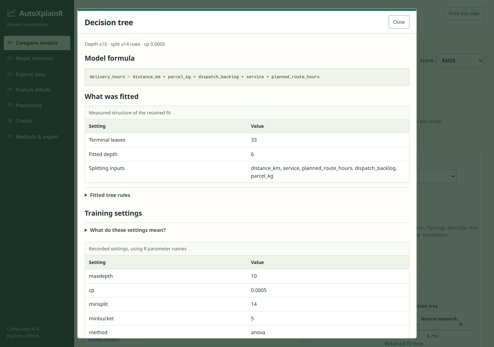
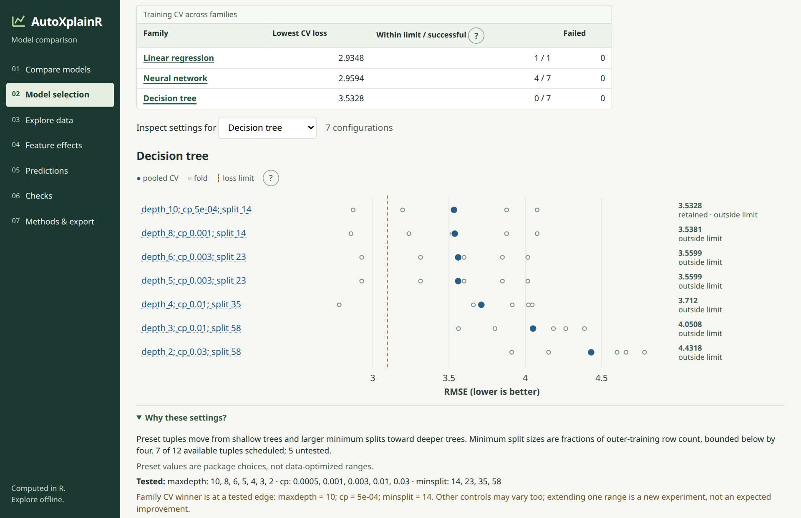
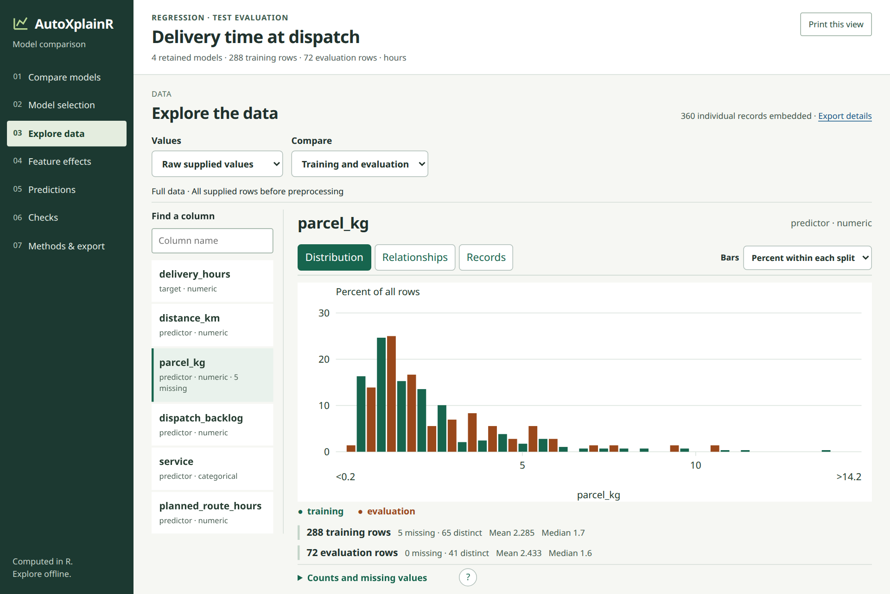

# AutoXplainR

Fit several models, compare their predictions and costs, and explore the data
behind their behavior with one R command.

[](https://matt17br.github.io/autoXplainR/model-report.html)

*Start with the models: how well do they predict, and what do they cost?
Preview uses synthetic data.
[Open the example report](https://matt17br.github.io/autoXplainR/model-report.html).*

Also explore [customer churn](https://matt17br.github.io/autoXplainR/binary-report.html)
or [three-class flower predictions](https://matt17br.github.io/autoXplainR/multiclass-report.html).
The churn data are synthetic; the flower example uses R's `iris` data.
These public previews deliberately include records, so you can try filters and
follow prediction mistakes back to the data. Reports you create default to aggregates.

## Try it

```r
# install.packages("pak")
pak::pak("Matt17BR/autoXplainR")

library(AutoXplainR)
result <- autoxplain(mtcars, "mpg", report = "model-report.html")
result
```

This schedules 15 settings across linear, tree and neural models using five
training-only cross-validation folds. It keeps one fitted representative per
successful family plus a baseline, evaluates them on a reproducible 20% holdout,
and writes a standalone report with importance and fitted effects. Regression,
binary classification and multiclass classification use the same command.

The default runs locally without Java, an API key or a language model. For a
fast reference model and baseline, set `model_set = "quick"`. AutoXplainR is
available on GitHub; it is not yet on CRAN.

`mtcars` is a small teaching example, not evidence that a model is ready for use.
For your own analysis, choose predictors that are available when a prediction
will be made. Exclude arbitrary identifiers and columns measured after the
outcome. The [first-report tutorial](https://matt17br.github.io/autoXplainR/articles/autoxplainr-introduction.html)
shows missing values, novel categories, an explicit split and recipe inspection.
Numeric outcomes with exactly two values are treated as binary classification;
use `task = "regression"` to override that choice. Binary probabilities refer to
the **second outcome factor level**. For `factor(outcome, levels = c("no", "yes"))`,
they are probabilities of `"yes"`. Set and inspect levels before fitting.

## A look inside the report

The report has focused tabs for comparison, model selection, data, feature
effects, predictions, checks and methods. Controls sit beside the values they
change; supporting explanations use **?** buttons and expandable details. Help
works on hover, keyboard focus and tap. Each screenshot below comes from the
same reproducible synthetic delivery example using the default model search.
The images show a focused working view; click one to explore its report tab.

### Compare models

Read scores beside measured costs. The primary model is compared with the
baseline, including a paired evaluation-sample interval when supported. Change
the score or resource axis to inspect the tradeoff; points carry model names.
The dashed **Pareto frontier** shows the best observed score available within
each resource budget. Outlined points have no alternative that is at least as
good on both displayed axes and better on one. The **CV choice** label records
training selection; the best score on the held-out rows can belong to another
model.

For a more useful timing comparison, run a repeated benchmark on a common batch:

```r
bench <- benchmark_predictions(result)
render_model_report(result, "report.html", benchmark = bench)
```

The report shows median prediction cost and repeat variation, with batch size,
timer resolution and measurement scope. It keeps the original fit and prediction
readings separate. Batch cost per row is not the latency of a single-row request.

### Explore inputs and fitted patterns

Switch models, then click an importance bar to select its fitted curve. The
report keeps the model, feature and prediction target explicit.

[](https://matt17br.github.io/autoXplainR/model-report.html#patterns)

### See exactly what was fitted

Each model shows its effective settings beside its name. **Model details** opens
the formula, coefficients or tree rules, fitted size, exact R controls, training
selection and preprocessing. The same settings follow the model into Features
and Predictions. In R, use `extract_model_characteristics(result)` or inspect
`result$models[["model_id"]]` directly.

[](https://matt17br.github.io/autoXplainR/model-report.html#overview)

### Understand the search

**Model selection** connects the retained model to its candidate settings and
fold scores. It separates the lowest cross-validation loss, the policy choice
and the model that successfully refitted. Inspect the numerical selection
threshold, parameter meanings, searched ranges and settings that failed.
The preset grid is a practical starting search, not an optimal configuration
claimed from the literature.

[](https://matt17br.github.io/autoXplainR/model-report.html#selection)

### Explore the underlying data

**Explore data** shows outcome and input distributions, missing values and joint
patterns across training and evaluation. Switch between supplied values and the
values used by models to see what preprocessing changed. Distributions and
missing-value counts use all available rows. Pairwise plots and associations use
up to 10,000 rows per partition by default, with the sample size shown.

[](https://matt17br.github.io/autoXplainR/model-report.html#data)

Individual records require an explicit export:

```r
render_model_report(result, "report-with-rows.html", report_data = "rows")
```

That adds row filters, linked scatter points and source-record inspection.
A record keeps its original input-table position after splitting and row removal.
Use `report_data_control()` to select explorer columns and bound the exported
row sample. Univariate profiles describe all available rows until a row filter
is applied; filtered views describe only the exported sample. Model scores stay unchanged.
Anyone receiving the HTML receives every embedded record, including hidden rows.
The default `"summary"` mode embeds aggregates; aggregates are not an anonymity
guarantee. `"none"` omits data exploration and per-record predictions. These
options do not remove feature names, fitted-model details or explanation results
from the rest of the report.

### Inspect predictions

Inspect residual distributions, confusion counts and calibration for the selected
model. For binary outcomes, move the decision cutoff to see false positives and
false negatives change. Official model scores stay unchanged. With row export
enabled, inspect confident classification mistakes and jump to their source
records. Copy the matching R prediction command. Checks and methods have their
own tabs; score uncertainty appears beside the comparison it describes.

**Do the models disagree?** compares their predictions on the same rows, beside
their scores. A difference involving a weak model is not evidence of prediction
uncertainty. Exported records with large differences link back to the Data view.

[](https://matt17br.github.io/autoXplainR/model-report.html#evaluation)

The HTML works offline and can be shared with someone who does not use R.
**Print this view** exports the active tab with the current model and feature;
expand any details you want included first. Without JavaScript, static tables
and model panels remain available; filtering, linked records and interactive
chart updates require JavaScript. See the
[reproduction instructions](https://github.com/Matt17BR/autoXplainR/blob/main/validation/README.md#report-screenshots).

## What you get in R

| Result | Where to find it |
|---|---|
| Fitted family representatives and baseline | `result$models` |
| Evaluation metrics and their definitions | `result$leaderboard`, `result$evaluation` |
| Predictions and errors on evaluation rows | `result$evaluation$predictions` |
| Repeated permutation importance and diagnostic findings | `result$explanations$audit` |
| Primary-model ALE/PDP curves | `result$explanations$effects` |
| Curves for every audited model | `result$explanations$effects_by_model` |
| Effect availability by model, class and input, with failure reasons | `result$explanations$effect_status` |
| Original partitions and source-row mapping | `result$data_context` |
| Candidate grid rationale and recorded selection decisions | `tuning_evidence(result)` |
| Training recipe, model selection and split details | `result$preprocessing_metadata`, `result$provenance` |
| Compact aggregate evidence for review or export | `evidence_summary(result)` |
| Repeated prediction measurements on a common batch | `benchmark_predictions(result)` |

The result and aggregate-evidence objects use schema 2.0. Other components carry
their own schema versions. Older saved results may lack source rows or current
identity checks; the report identifies unavailable context or requests that you
recompute incompatible evidence. Saved 0.5.0 results can require new explanations:

```r
older <- readRDS("analysis-0.5.0.rds")
render_model_report(older, "updated-report.html", top_features = 2, n_repeats = 3)
```

This explicit small budget recomputes explanations without refitting. Retained
0.5.0 audits fail the newer identity check. The recipe was replayed on saved
regression, binary and multiclass results; it is not a promise that every custom
predictor or external dependency can be recovered. Use a larger explanation
budget for the analysis you intend to share.

```r
predict(result, mtcars[1:3, ])       # applies the saved recipe; does not refit
saveRDS(result, "analysis.rds")     # native R models and their evidence
render_model_report(result, "report.html")
```

Reports include paired bootstrap intervals for the primary model and baseline
when the sampling design supports them. Unsupported designs show the reason;
`uncertainty = TRUE` requires an interval and `FALSE` omits it. These intervals
describe evaluation-sample uncertainty conditional on the fitted models; they
exclude uncertainty from retraining and tuning.

## Choose the validation design before interpreting scores

The default split assumes rows can be sampled independently. Repeated patients,
sites, households, or observations over time need a different boundary:

```r
# Keep every row from a patient in the same outer partition and tuning fold.
result <- autoxplain(
  measurements, "outcome",
  validation = validation_split(group = "patient_id")
)

# Train on earlier times; reserve the latest times and exclude two time values
# immediately before the test period. Tied times stay together.
result <- autoxplain(
  observations, "outcome", model_set = "comparison",
  validation = validation_split(time = "recorded_at", gap = 2)
)
```

Split columns are excluded from predictors. `test_fraction` refers to groups or
distinct times in these designs, so the fraction of rows can differ. Grouped
classification tuning requires all classes in each fold; infeasible designs
fail explicitly. Chronological splitting currently supports quick and comparison
modes. Temporal tuning needs rolling-origin resampling and is not implemented.

For an existing external evaluation set, use `test_data = evaluation_data`.
Its default role is the neutral `"evaluation"`. Set `evaluation_role = "test"`
only if its provenance supports that interpretation. Duplicate-valued rows
across supplied training and evaluation sets trigger a possible-leakage warning.

## Compare or tune models

The default already searches across the core model families. Inspect its
training selection and retained candidates in R:

```r
tuned <- autoxplain(
  iris, "Species", model_set = "tuned", portfolio = "core", seed = 2026
)
tuning_results(tuned)
compare_model_behavior(tuned)
```

| Mode | What it fits | How the primary model is chosen |
|---|---|---|
| `quick` | Linear/logistic/multinomial model and baseline | Pre-specified |
| `comparison` | The same models plus two trees | Primary remains pre-specified; ranks are descriptive |
| `tuned` (default) | Core or explicitly requested model families and baseline | Training-only cross-validation; one-standard-error rule by default |

For a wider search, choose a portfolio and install its optional engines explicitly. The
[model-selection guide](https://matt17br.github.io/autoXplainR/articles/model-selection.html)
explains portfolio support, selection rules and recorded failures:

```r
learner_catalog()
install_model_engines("recommended", dry_run = TRUE)
# install_model_engines("recommended")
# autoxplain(data, "outcome", model_set = "tuned", portfolio = "recommended")
```

Missing engines produce an installation instruction; the package does not change
the requested portfolio based on what happens to be installed. Training recipes
are learned again inside each fold. Candidate settings, fold scores, warnings,
failures and out-of-fold predictions are retained by `tuning_results()`.
Experienced users can specify `learners`, `max_models` and `tuning_control()`.
Explicit optimizer nonconvergence excludes a candidate by default. The optional
`optimization_policy = "warn"` retains it with its optimizer status; an unknown
status is never presented as proof of convergence.
H2O AutoML remains available through `engine = "h2o"` and requires Java.

### Does it handle harder problems?

The optional learners matter. In a fixed-split stress comparison with 240 inputs
and 180 training rows, the core search selected a tree with test RMSE 3.253;
an equally sized regularized/forest/boosting search selected a regularized model
with RMSE 1.122. Native cross-validated lasso scored 1.130. A nonlinear interaction
problem also benefited substantially from boosting. On Bank Marketing the
difference was small, and on rare outcomes better ranking did not always mean
better probabilities. These are measured examples, not a general leaderboard.
See the [results and reproducible protocol](https://github.com/Matt17BR/autoXplainR/blob/main/validation/stress-modeling/findings.md).

For demanding tabular data, start with the optional portfolio and inspect both
failed configurations and the retained alternatives. High-dimensional linear
fits can complete while making very poor predictions. The report preserves
their scores and flags rank-deficient fits; it does not quietly discard them.
The [model-selection guide](https://matt17br.github.io/autoXplainR/articles/model-selection.html)
explains how to separate model fitting from a bounded explanation and report.
In version 0.6.2, the broad `recommended` preset searched 30 configurations and
took 8 minutes 53 seconds on the nonlinear case, versus 58 seconds for the
explicit three-family search, and selected the same fitted model. Choose the
families deliberately when turnaround time matters.

Larger data also need separate fitting, explanation and export budgets. The
default explanation uses up to 5,000 evaluation rows, while scores still use
the full evaluation set. Use `explanation_rows = NULL` to remove that cap, or
`tuning_control(retain_oof = FALSE)` to keep aggregate CV evidence without the
case-level predictions. The [larger-data guide](https://matt17br.github.io/autoXplainR/articles/model-selection.html#larger-data)
explains the controls, the separate PDP curve limit and what each changes.

## Inspect a question in more detail

```r
performance_uncertainty(result)        # fixed-model paired evaluation bootstrap
model_tradeoffs(result)               # error, size, time and candidate Pareto frontier
prediction_ambiguity(result)          # where supplied models give different answers
calibration_diagnostics(tuned)        # probabilities versus observed frequencies
compare_model_effects(tuned, "Petal.Length", class = "virginica")
```

Use `evaluate_models()` to bring already fitted models into the same report:

```r
fit <- lm(mpg ~ wt + hp, data = mtcars[1:20, ])
evaluated <- evaluate_models(list(linear = fit), mtcars[21:32, ], "mpg",
  features = c("wt", "hp")
)
render_model_report(evaluated, "existing-model.html")
```

No training history, reference model or selection process is inferred. Supply
custom prediction functions for other model classes, and an explicit reference
if you want a baseline comparison. Use `as_explainers()` to work with individual
retained models, or `explain_model()` for a focused model audit. Lower-level tools
include grouped permutation importance, ALE, PDP, subgroup performance,
missingness shift and binary threshold diagnostics.

For fitting without explanations, set `explain = FALSE`. The default explanation
budget screens all inputs for up to five models, audits the union of their top
eight inputs with 20 permutations, and computes up to eight fitted curves per
model and outcome class. In multiclass reports, use **Curve for class** to switch
probability curves; importance continues to summarize loss across all classes. Large
feature sets or expensive prediction functions can take time. A report request
computes explanations even if `explain = FALSE`. Explicit report budgets such as
`n_repeats = 50` recompute evidence; otherwise the report reuses retained results.

## What the evidence means

- Permutation importance measures reliance of a fitted model. Its intervals
  describe random-shuffle Monte Carlo error, not population uncertainty.
- Correlated inputs can substitute for each other and make marginal shuffling
  unrealistic. Pairwise association summaries reveal some relationships;
  small values do not establish independence.
- ALE and PDP describe fitted associations, not the causal effect of an action.
- Model disagreement covers the supplied fits. It is not a prediction interval
  or a search of every plausible model.
- Completed diagnostics do not establish fairness, safety or readiness for
  deployment. Feature screening and repeated holdout inspection
  also limit what can be claimed from the same data.

AutoXplainR's intended contribution is the compact workflow connecting validation,
model comparison, explanation diagnostics and shareable evidence. It is not a
new explanation estimator, and superiority over other packages has not been
established. [modelStudio](https://doi.org/10.21105/joss.01798) and
[modelDown](https://doi.org/10.21105/joss.01444) already provide automated explanation
interfaces; [DALEX](https://jmlr.org/papers/v19/18-416.html) and
[xplainfi](https://mlr-org.github.io/xplainfi/articles/inference.html) cover broader
explanation and importance-inference use cases.

## Documentation and development

- [Getting started](https://matt17br.github.io/autoXplainR/articles/autoxplainr-introduction.html)
- [Function reference](https://matt17br.github.io/autoXplainR/reference/index.html)
- [Near-term development plan](https://matt17br.github.io/autoXplainR/ROADMAP.html)
- [Validation and diagnostics](https://matt17br.github.io/autoXplainR/articles/validation-and-diagnostics.html)
- [Bring your own fitted models](https://matt17br.github.io/autoXplainR/articles/existing-models-and-narratives.html)
- [Statistical methods](https://matt17br.github.io/autoXplainR/articles/statistical-methods.html)
- [Validation scripts and evidence](https://github.com/Matt17BR/autoXplainR/tree/main/validation)
- [Contributing](https://matt17br.github.io/autoXplainR/CONTRIBUTING.html) and [release checklist](https://matt17br.github.io/autoXplainR/RELEASE_CHECKLIST.html)

```r
devtools::document()
devtools::test()
devtools::check()
```

Live H2O integration is opt-in with `AUTOXPLAIN_RUN_H2O=true`. Hosted narrative
providers are also opt-in; the default narrative renders retained evidence locally.
Hosted output is checked for format and length, not numerical grounding.
See [provider setup](LLM_PROVIDERS.md). Reports and aggregate exports can contain
feature names and diagnostic messages; review them before sharing. Saved RDS
results contain the training and evaluation data.

MIT license. Copyright 2025–2026 Matteo Mazzarelli.
