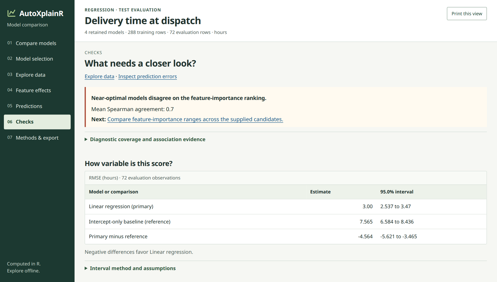

# AutoXplainR

Fit a tabular prediction model, check it against a simple baseline, and inspect
what it learned—with one R command.

[](https://matt17br.github.io/autoXplainR/model-report.html)

*Start with the result: how well did the model predict, and did it improve on a
simple baseline? Preview uses synthetic data.
[Open the example report](https://matt17br.github.io/autoXplainR/model-report.html).*

## Try it

```r
# install.packages("pak")
pak::pak("Matt17BR/autoXplainR")

library(AutoXplainR)
result <- autoxplain(mtcars, "mpg", report = "model-report.html")
result
```

This fits a linear regression and an intercept-only baseline, evaluates them on
a reproducible 20% holdout, computes feature importance and fitted effects, and
writes a standalone HTML report.
[View a generated example](https://matt17br.github.io/autoXplainR/model-report.html). Classification uses logistic or multinomial
regression instead. The default runs locally without Java, an API key, or a
language model. AutoXplainR is distributed on GitHub; it is not yet on CRAN.

`mtcars` is a small teaching example, not evidence that a model is ready for use.
For your own analysis, supply a data frame and the name of the outcome column.
Numeric outcomes with exactly two values are treated as binary classification;
use `task = "regression"` to override that choice. Binary probabilities refer to
the **second outcome factor level**; set your factor levels deliberately.

## A look inside the report

These screenshots come from the current package's report on reproducible
synthetic data, using `model_set = "comparison"`. The example adds two decision
trees to the default model and baseline. Its numbers differ from the `mtcars`
quick start above. Click any screenshot to open that part of the full report.

### Compare the candidates

See prediction error alongside approximate model size. The chart helps you
inspect trade-offs; the best score on these rows is not a new model-selection rule.

[](https://matt17br.github.io/autoXplainR/model-report.html#models)

### See which inputs mattered, and how

Feature importance shows which inputs the model relied on. The curves show the
direction of its fitted patterns, with a short explanation beside each one.

[](https://matt17br.github.io/autoXplainR/model-report.html#patterns)

### Find the caveats and next steps

The reliability section flags weak evidence and suggests what to inspect next.
Its grade is a diagnostic aid, not a certification of the model.

[](https://matt17br.github.io/autoXplainR/model-report.html#reliability)

The report is a standalone HTML file you can open offline or share with someone
who does not use R. See the [example-generation and screenshot instructions](https://github.com/Matt17BR/autoXplainR/blob/main/validation/README.md#report-screenshots)
to reproduce these views.

## What you get in R

| Result | Where to find it |
|---|---|
| Fitted primary model and baseline | `result$models` |
| Evaluation metrics and their definitions | `result$leaderboard`, `result$evaluation` |
| Predictions and errors on evaluation rows | `result$evaluation$predictions` |
| Repeated permutation importance and diagnostic findings | `result$explanations$audit` |
| Up to three fitted ALE/PDP curves | `result$explanations$effects` |
| Effects that could not be computed, with reasons | `result$explanations$failures` |
| Training recipe, model selection and split details | `result$preprocessing_metadata`, `result$provenance` |
| Compact aggregate evidence for review or export | `evidence_summary(result)` |

The report leads with performance against the baseline, then explains fitted
patterns and the limits of the evidence. It works offline in a browser and has
a print stylesheet. The numerical objects remain available in R.

```r
predict(result, mtcars[1:3, ])       # applies the saved recipe; does not refit
saveRDS(result, "analysis.rds")     # native R models and their evidence
render_model_report(result, "report.html", uncertainty = TRUE)
```

The last call adds paired bootstrap intervals for evaluation performance and
the difference from the baseline. These describe evaluation-sample uncertainty
for the fitted models, not uncertainty from retraining or tuning.

## Choose the validation design before interpreting scores

The default split assumes rows can be sampled independently. Repeated patients,
sites, households, or observations over time need a different boundary:

```r
# Keep every row from a patient in the same outer partition and tuning fold.
result <- autoxplain(
  measurements, "outcome",
  validation = validation_split(group = "patient_id")
)

# Train on earlier times; reserve the latest times and exclude two time values
# immediately before the test period. Tied times stay together.
result <- autoxplain(
  observations, "outcome",
  validation = validation_split(time = "recorded_at", gap = 2)
)
```

Split columns are excluded from predictors. `test_fraction` refers to groups or
distinct times in these designs, so the fraction of rows can differ. Grouped
classification tuning requires all classes in each fold; infeasible designs
fail explicitly. Chronological splitting currently supports quick and comparison
modes. Temporal tuning needs rolling-origin resampling and is not implemented.

For an existing external evaluation set, use `test_data = evaluation_data`.
Its default role is the neutral `"evaluation"`. Set `evaluation_role = "test"`
only if its provenance supports that interpretation. Duplicate-valued rows
across supplied training and evaluation sets trigger a possible-leakage warning.

## Compare or tune models

Start with the simple default. To search across model families without selecting
on the final holdout:

```r
tuned <- autoxplain(
  iris, "Species", model_set = "tuned", portfolio = "core", seed = 2026
)
tuning_results(tuned)
compare_model_behavior(tuned)
```

| Mode | What it fits | How the primary model is chosen |
|---|---|---|
| `quick` (default) | Linear/logistic/multinomial model and baseline | Pre-specified |
| `comparison` | The same models plus two trees | Primary remains pre-specified; ranks are descriptive |
| `tuned` | Requested model families and baseline | Training-only cross-validation; one-standard-error rule by default |

The core portfolio uses linear models, trees and neural networks. Optional
portfolios add regularization, additive models, forests, boosting, radial
kernels, nearest neighbors and MARS. Inspect support and dependencies first:

```r
learner_catalog()
install_model_engines("recommended", dry_run = TRUE)
# install_model_engines("recommended")
# autoxplain(data, "outcome", model_set = "tuned", portfolio = "recommended")
```

Missing engines produce an installation instruction; the package does not change
the requested portfolio based on what happens to be installed. Training recipes
are learned again inside each fold. Candidate settings, fold scores, warnings,
failures and out-of-fold predictions are retained by `tuning_results()`.
Experienced users can specify `learners`, `max_models` and `tuning_control()`.
H2O AutoML remains available through `engine = "h2o"` and requires Java.

## Inspect a question in more detail

```r
performance_uncertainty(result)        # fixed-model paired evaluation bootstrap
model_tradeoffs(result)               # error, size, time and candidate Pareto frontier
prediction_ambiguity(result)          # where supplied models give different answers
calibration_diagnostics(tuned)        # probabilities versus observed frequencies
compare_model_effects(tuned, "Petal.Length", class = "virginica")
```

Use `as_explainers()` to work with individual retained models, or `explain_model()`
to bring an existing model and a custom prediction function. Lower-level tools
include grouped permutation importance, ALE, PDP, subgroup performance,
missingness shift and binary threshold diagnostics.

For fitting without explanations, set `explain = FALSE`. The default explanation
budget screens all features, audits the eight highest-ranked inputs across up
to five models with 20 permutations, and computes up to three effects. Large
feature sets or expensive prediction functions can take time. A report request
computes explanations even if `explain = FALSE`. Explicit report budgets such as
`n_repeats = 50` recompute evidence; otherwise the report reuses retained results.

## What the evidence means

- Permutation importance measures reliance of a fitted model. Its intervals
  describe random-shuffle Monte Carlo error, not population uncertainty.
- Correlated inputs can substitute for each other and make marginal shuffling
  unrealistic. The report diagnoses dependence; it does not solve it.
- ALE and PDP describe fitted associations, not the causal effect of an action.
- Model disagreement covers the supplied fits. It is not a prediction interval
  or a search of every plausible model.
- A favorable score or diagnostic grade does not certify fairness, safety or
  readiness for deployment. Feature screening and repeated holdout inspection
  also limit what can be claimed from the same data.

AutoXplainR's intended contribution is the compact workflow connecting validation,
model comparison, explanation diagnostics and shareable evidence. It is not a
new explanation estimator, and superiority over other packages has not been
established. [modelStudio](https://doi.org/10.21105/joss.01798) and
[modelDown](https://doi.org/10.21105/joss.01444) already provide automated explanation
interfaces; [DALEX](https://jmlr.org/papers/v19/18-416.html) and
[xplainfi](https://mlr-org.github.io/xplainfi/articles/inference.html) cover broader
explanation and importance-inference use cases.

## Documentation and development

- [Getting started](https://matt17br.github.io/autoXplainR/articles/autoxplainr-introduction.html)
- [Function reference](https://matt17br.github.io/autoXplainR/reference/index.html)
- [Architecture and development plan](https://matt17br.github.io/autoXplainR/ROADMAP.html)
- [Statistical methods](https://matt17br.github.io/autoXplainR/articles/statistical-methods.html)
- [Validation scripts and evidence](https://github.com/Matt17BR/autoXplainR/tree/main/validation)
- [Contributing](https://matt17br.github.io/autoXplainR/CONTRIBUTING.html) and [release checklist](https://matt17br.github.io/autoXplainR/RELEASE_CHECKLIST.html)

```r
devtools::document()
devtools::test()
devtools::check()
```

Live H2O integration is opt-in with `AUTOXPLAIN_RUN_H2O=true`. Hosted narrative
providers are also opt-in; the default narrative is deterministic and local.
See [provider setup](LLM_PROVIDERS.md). Reports and aggregate exports can contain
feature names and diagnostic messages; review them before sharing. Saved RDS
results contain the training and evaluation data.

MIT license. Copyright 2025–2026 Matteo Mazzarelli.
