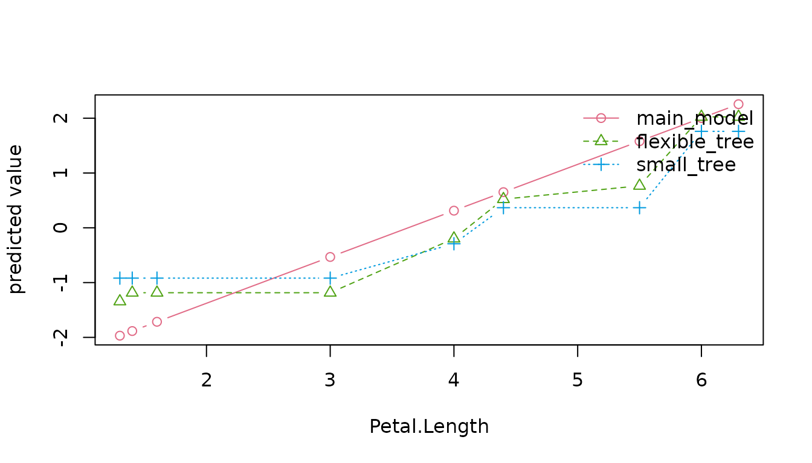

# Compare and tune models

The default, `model_set = "tuned", portfolio = "core"`, schedules 15
settings across linear, tree and neural families using five
training-only folds. It retains a representative from each successful
family and a baseline for the report. The selected model is evaluated on
rows kept outside that search.

`model_set = "quick"` fits a pre-specified linear, logistic or
multinomial model and a baseline. `"comparison"` adds two pre-specified
trees but keeps the same primary model. Its evaluation ranks are
descriptive. Use `"tuned"` when the analysis calls for model selection:
candidates are compared using training-only cross-validation before the
selected model is scored on the outer evaluation set.

## Choose a portfolio

``` r

as.data.frame(learner_catalog())[, c("family", "backend", "supported_tasks", "portfolios")]
#>         family    backend                supported_tasks
#> 1       linear stats/nnet regression, binary, multiclass
#> 2  regularized     glmnet regression, binary, multiclass
#> 3     additive       mgcv             regression, binary
#> 4         tree      rpart regression, binary, multiclass
#> 5       forest     ranger regression, binary, multiclass
#> 6     boosting    xgboost regression, binary, multiclass
#> 7       neural       nnet regression, binary, multiclass
#> 8       kernel      e1071 regression, binary, multiclass
#> 9    neighbors       kknn regression, binary, multiclass
#> 10        mars      earth             regression, binary
#>                     portfolios
#> 1  core, recommended, extended
#> 2        recommended, extended
#> 3        recommended, extended
#> 4  core, recommended, extended
#> 5        recommended, extended
#> 6        recommended, extended
#> 7               core, extended
#> 8                     extended
#> 9                     extended
#> 10                    extended
```

| Portfolio | Included families | Dependencies |
|----|----|----|
| `core` | Linear, tree, neural | Ordinary package dependencies |
| `recommended` | Linear, regularized, additive, tree, forest, boosting | Optional engines installed explicitly |
| `extended` | All ten, including kernel, nearest-neighbor and MARS | Additional optional engines |

Additive and MARS learners support regression and binary tasks. The
requested portfolio does not change silently with installed packages; a
missing engine produces an installation instruction.

``` r

tuned <- autoxplain(iris, "Species", model_set = "tuned", portfolio = "core",
                    max_models = 6, nfolds = 3, seed = 2026)
tuning <- tuning_results(tuned)
tuning$candidates[, c("model", "hyperparameters", "cv_score", "cv_se", "selected")]
#>                             model
#> 1                  neural network
#> 2                  neural network
#> 3                   decision tree
#> 4                   decision tree
#> 5                   decision tree
#> 6 multinomial logistic regression
#>                                                 hyperparameters   cv_score
#> 1 hidden units = 2, weight decay = 0.03, iteration limit = 2000 0.09445857
#> 2  hidden units = 1, weight decay = 0.1, iteration limit = 2000 0.29456937
#> 3         max depth = 6, pruning cp = 0.003, minimum split = 10 2.37836688
#> 4          max depth = 2, pruning cp = 0.03, minimum split = 24 2.39466788
#> 5          max depth = 4, pruning cp = 0.01, minimum split = 14 2.39466788
#> 6                                       default statistical fit         NA
#>        cv_se selected
#> 1 0.03609199     TRUE
#> 2 0.01072168    FALSE
#> 3 1.40932486    FALSE
#> 4 1.40612488    FALSE
#> 5 1.40612488    FALSE
#> 6         NA    FALSE
```

Every fold learns its preprocessing from that fold’s training rows. The
default one-standard-error rule favors the first eligible family in the
documented priority, then its smallest recorded within-family capacity
proxy. Some tuning dimensions are not ordered by that proxy; for
example, a neural weight-count proxy does not order weight decay.
Cross-family priority is a package policy, not a statistical ordering of
model families. Fold-score standard errors are a selection heuristic,
not independent-test confidence intervals. Use `tuning_rule = "best"`
for the lowest resampled error instead.

``` r

evidence <- tuning_evidence(tuned)
evidence$selection[c("best_configuration", "selected_configuration", "threshold")]
#> $best_configuration
#> [1] "neural_02"
#> 
#> $selected_configuration
#> [1] "neural_02"
#> 
#> $threshold
#> [1] 0.1305506
```

The report’s **Model selection** view connects those decisions to the
parameter values, effective fold settings and retained fit. The default
grid is a small, versioned set of contrasting controls. It does not
follow a theorem that makes those numbers optimal for your data. A
winning setting on the edge of a searched range is a reason to
investigate that range, not evidence that it should always be extended.
The range includes failed attempts: being inside it does not imply that
neighboring settings produced usable fits. Inspect the successful count
and failure reasons. Candidate comparisons stay inside training data.

Explicit optimizer nonconvergence excludes a configuration by default.
Fold and refit records retain the status and reason.
`optimization_policy = "warn"` in
[`tuning_control()`](https://matt17br.github.io/autoXplainR/reference/tuning_control.md)
deliberately keeps such fits with a warning; an unreported optimizer
status remains unknown. Successful family representatives use their
lowest valid within-family CV loss, while the primary follows the
configured global selection rule. These are different choices.

``` r

install_model_engines("recommended")
result <- autoxplain(my_data, "outcome", model_set = "tuned", portfolio = "recommended")
```

[`tuning_control()`](https://matt17br.github.io/autoXplainR/reference/tuning_control.md)
accepts explicit parameter grids, fold IDs, selection rules and failure
policies. Inspect its help and
[`tuning_results()`](https://matt17br.github.io/autoXplainR/reference/tuning_results.md)
before changing these defaults. Chronological tuning is not implemented;
temporal model selection requires an explicit rolling-origin design
outside this workflow.

## Harder data need a deliberate search

The core portfolio keeps installation simple. It does not include
regularization, random forests or boosting. With many predictors,
nonlinear interactions or weak signals, try `portfolio = "recommended"`
before concluding that useful prediction is impossible. It schedules 30
configurations by default. You can also choose families and a budget
explicitly:

``` r

install_model_engines("recommended")
result <- autoxplain(
  training, "outcome", test_data = final_test, evaluation_role = "test",
  learners = c("regularized", "forest", "boosting"),
  max_models = 30, nfolds = 5, explain = FALSE, seed = 2026
)
tuning_results(result)$candidates
result$leaderboard
result$model_diagnostics
```

Keep `final_test` separate before making modeling choices. Select the
search and metric using the training problem, then inspect its held-out
result once. Repeated choices based on the same test scores turn that
set into development data.

The [stress
comparison](https://github.com/Matt17BR/autoXplainR/blob/main/validation/stress-modeling/findings.md)
uses independent native fits, two synthetic replicates and a real
mixed-data problem. Regularization was particularly useful when
predictors outnumbered training rows. Boosting improved the nonlinear
regression example. Neither guaranteed an improvement in every
classification metric. Accuracy alone can be misleading for rare
outcomes: inspect probability loss, ranking and mistakes at a decision
cutoff appropriate to the intended use.

Failed configurations remain in the search record. A model can also
finish but be unsuitable. Rank-deficient linear fits now record that
their coefficients are not uniquely determined and that new predictions
may be unstable. Their actual scores stay in the comparison.

The automatic GAM adapter excludes a fit when its number of predictor
terms is at least its number of fitting rows. This conservative resource
policy is checked inside each fold. It avoids an expensive search that
was unproductive in the wide-data stress case; it is not a mathematical
restriction on penalized GAMs. Use another family or bring an externally
fitted GAM through
[`evaluate_models()`](https://matt17br.github.io/autoXplainR/reference/evaluate_models.md).
Other engine-specific limitations, including extreme numerical units,
can still exclude individual candidates. Inspect the recorded reason.

The broad preset can be slow even when every fit succeeds. A fresh
paired run on the 1,200-row, 30-input nonlinear stress case took 412
seconds in version 0.6.2 and 65 seconds in the candidate, with all 30
configurations successful. Both selected the same boosted model and had
the same evaluation RMSE. These are single runs on one machine, not a
general speed guarantee. An earlier, separate 0.6.2 run took 533
seconds; it is not the paired baseline for the 65-second result.

Automatic additive fitting uses continuous BAM at 10,000 outer-training
rows. Gaussian regression also uses BAM when the estimated work, rows
times the number of coefficients squared, reaches 10 million. Smaller
binary problems retain nested GAM: BAM uses a different iteratively
weighted procedure that failed on several training folds where GAM
converged. The choice stays fixed across folds and the final refit,
while each fitting partition learns its own preprocessing and smoothing
penalties. This rule uses the task and training input size, not
validation or final-test scores.

The row threshold is a computational policy, not a guarantee of
convergence or better predictions. Pin `solver = "gam"` or
`solver = "bam"` in an additive grid when a particular fitting procedure
matters. Covariate discretization requires the explicit `"bam_discrete"`
choice. The smaller family set above remains useful when the broader
search costs more than the additional models are worth.

## Budget explanations and the report separately

Fitting, explaining and exporting are different costs. `explain = FALSE`
lets you inspect the search first. Request a small report explicitly,
then increase its explanation budget when the fitted models deserve
closer investigation:

``` r

render_model_report(result, "first-look.html", top_features = 3, n_repeats = 5,
                    explanation_rows = 2000, report_data = "summary",
                    uncertainty = FALSE)
```

Even a small feature audit first screens inputs; expensive prediction
functions and hundreds of columns can take time. Five permutations are a
first look, not precise importance estimates. The report records the
budget and warns about unstable Monte Carlo estimates.

This first report also omits paired score intervals. By default, those
intervals use 1,000 bootstrap resamples of the complete evaluation set,
independently of the explanation and export limits.
`uncertainty = FALSE` skips that calculation; model scores still use the
complete evaluation set. Omit this argument to include the intervals
when the validation design supports them.

Rendering returns the HTML path and leaves `result` unchanged. If the
result was fitted with `explain = FALSE`, repeat the explanation
settings in later renders: the first report does not save its evidence
or budget back into `result`. Omitting those settings computes default
explanations unless the result already contains retained explanations.

## Larger data

The rows used to fit and score models are distinct from the rows used to
explain them or included in HTML.
[`autoxplain()`](https://matt17br.github.io/autoXplainR/reference/autoxplain.md)
fits on the complete processed training partition and scores the
complete processed evaluation partition. Rows removed by an explicit
preprocessing rule remain recorded as omissions.

The report’s default importance and effect calculations use at most
5,000 evaluation rows. Pairwise plots and associations use at most
10,000 rows per partition. Unfiltered distributions and missing counts
use all available rows. Filtered charts and their counts describe only
matching exported records; sidebar counts keep the full population.
Official model scores always use the complete evaluation partition and
are unchanged by filters. Each sampled view gives its own denominator. A
rare class or small cluster can be absent from a uniform sample even
when its full count is visible elsewhere. Increasing permutation repeats
does not resolve that absence, and shuffle intervals do not measure
row-sampling uncertainty.

``` r

result <- autoxplain(
  training, "outcome", test_data = final_test,
  learners = c("regularized", "boosting"), max_models = 12, nfolds = 3,
  tuning_control = tuning_control(retain_oof = FALSE),
  explanation_rows = 5000, report = "model-report.html"
)

# Include a bounded sample for record inspection and browser filters.
render_model_report(
  result, "records.html",
  report_data = report_data_control(mode = "rows", max_rows = 20000, max_pair_rows = 10000)
)
```

Choose the search and validation design before looking at the final test
scores. The example budget is a starting point, not a claim that twelve
settings are enough for a difficult problem. `retain_oof = FALSE` saves
memory by omitting case-level CV predictions; fold scores, candidate
settings and selection remain available. Use the default `TRUE` when you
need to inspect individual CV errors. This control does not reduce
fitting rows or final evaluation rows.

The measured million-row regression control used a smaller search: one
regularized and one boosting configuration, two CV folds and
`retain_oof = FALSE`. One call fitted all million training rows, scored
all 20,000 independent evaluation rows and wrote a 3,891,782-byte
summary report in 81.055 seconds. Default explanations used 5,000 rows;
all 1,000 paired bootstrap draws used the full evaluation set. The
shallow selected model had RMSE 1.6835. A separate three-configuration
search selected 600 boosting rounds at depth 6 and reached RMSE 0.7491
in 109.012 seconds with explanations disabled. These single-host results
measure different workloads; see the
[measurements](https://github.com/Matt17BR/autoXplainR/blob/main/validation/scalability/findings.md).

Large result checks write complete model and data state to a temporary
file, then remove it. The temporary file system needs space for that
serialization. If you need disk-backed temporary storage, set `TMPDIR`
to an existing, writable directory on disk before starting R. Changing
it after R starts does not move the session’s temporary directory.

Neural configurations now allow up to 2,000 optimizer iterations, and
stop earlier when they converge. The former 500-iteration ceiling
excluded wider networks on the nonlinear stress problem even when more
iterations produced useful fits. `maxit` is an explicit neural grid
setting, so you can retain the former budget or choose another
allowance. Inspect convergence and failed configurations alongside
scores. A larger allowance can improve model selection but also
increases fitting time; it does not guarantee convergence.

Use `explanation_rows = NULL` to remove the report explanation cap and
`report_data_control(max_pair_rows = NULL)` for all-row pair summaries.
The lower-level
[`calculate_permutation_importance()`](https://matt17br.github.io/autoXplainR/reference/calculate_permutation_importance.md),
[`audit_explanations()`](https://matt17br.github.io/autoXplainR/reference/audit_explanations.md)
and
[`explain_effect()`](https://matt17br.github.io/autoXplainR/reference/explain_effect.md)
have no shared row cap by default and accept `max_rows` explicitly. PDP
has its separate `sample_size` control: its curve and support
distribution can use different row counts, both recorded in the result.

Large reports store compressed column values and unpack them offline as
needed. Compression does not remove exported values. The Data tab’s
linked scatter shows at most 1,500 points; filters and record lookup use
all exported rows. Exporting every row can still create a large file and
considerable browser memory use; leave `report_data = "summary"` unless
individual records serve a concrete purpose.

For large categorical expansions, automatic boosting encoding uses
native categorical splits instead of a numeric contrast matrix. The
threshold is an estimated matrix with more than 50 million cells and
more than twice the input width. The representation is fixed for a
search from outer-training inputs; category mappings and preprocessing
stay inside each fold. The two representations are different models, not
interchangeable numerical shortcuts. Set `encoding = "matrix"` or
`"native"` in an explicit boosting grid to control this choice. The
search record and report show what was used and why.

Use
[`report_data_control()`](https://matt17br.github.io/autoXplainR/reference/report_data_control.md)
to restrict exported columns or sample records if you need row
filtering. Full records for hundreds of columns make a large HTML file.
Aggregate mode keeps full univariate summaries and bounded pair
summaries but does not allow row filtering. `max_models` bounds the
number of attempted configurations, not elapsed time. `max_runtime_secs`
is an H2O setting and does not impose a local-engine timeout.

## Compare fitted behavior

``` r

comparison <- autoxplain(iris, "Sepal.Length", model_set = "comparison", seed = 2026)
compare_model_behavior(comparison)
#> <AutoXplainR model behavior comparison>
#>   models:      3 (main_model, small_tree, flexible_tree)
#>   evidence:    30 test rows
#>   performance: rmse (lower is better)
#>   trade-off:   model_size_kb (resource proxy)
#>   distance:    absolute difference in predicted target units
#>   feature check: not computed
#> 
#> Models at a glance
#>          model family backend   rmse relative_gap model_size_kb
#>   main_model * linear   stats 0.2736         0.0%         58.60
#>     small_tree   tree   rpart 0.4490        64.1%         40.81
#>  flexible_tree   tree   rpart 0.4103        49.9%         46.84
#>   * best supplied evaluation score; rankings remain descriptive
#> 
#> What differs
#>   - main_model has the best supplied rmse score (0.2736).
#>   - main_model and small_tree differ most on average (0.29 using absolute difference in predicted target units).
#>   - Before considering this dataset, main_model allows none unless encoded in features with none unless specified in features; small_tree allows stepwise with automatic along tree paths.
#> 
#> Evidence key
#>   behavior cards = prior knowledge about model capacity
#>   metrics, prediction gaps, and optional permutation importance = computed evidence
#>   caution: descriptive comparison, not causal or uncertainty coverage
head(prediction_ambiguity(comparison)$rows)
#>   evaluation_row row_id observed prediction_min prediction_max prediction_range
#> 1              1    121      6.9       6.322807       6.746404      0.423597456
#> 2              2     38      4.9       4.800000       5.111729      0.311729049
#> 3              3     45      5.1       5.037500       5.553309      0.515809353
#> 4              4    111      6.5       6.320000       6.323176      0.003176116
#> 5              5     91      5.5       6.009130       6.385714      0.376584687
#> 6              6    108      7.3       7.238864       7.716667      0.477802181
#>   prediction_sd
#> 1   0.225104561
#> 2   0.162834886
#> 3   0.258093469
#> 4   0.001737014
#> 5   0.201728726
#> 6   0.275859218
```

Family descriptions state what an algorithm can represent. The scores
and prediction differences describe what these particular fitted models
did on common evaluation rows. Disagreement does not supply prediction
intervals or identify the correct prediction.

``` r

effects <- compare_model_effects(comparison, "Petal.Length", method = "ale", n_points = 8)
plot(effects)
```



Effects are evaluated on a common grid. Their differences cover the
supplied fits, not every competitive model or uncertainty from
refitting. For multiclass outcomes, request a named class with
`class = "virginica"`.

[`model_tradeoffs()`](https://matt17br.github.io/autoXplainR/reference/model_tradeoffs.md)
offers optional performance/resource comparisons. Its default size axis
measures approximate R object storage, not structural complexity. Use it
when storage or runtime is relevant to a concrete constraint; a
favorable Pareto position is not a model-selection rule.

For repeated prediction measurements on the same rows:

``` r

bench <- benchmark_predictions(comparison)
render_model_report(comparison, "report.html", benchmark = bench)
```

The benchmark records a common batch, warmup, repeated blocks, warnings
and timing limits. A per-row batch cost is not single-request latency;
quartiles describe the repeated measurements, not a confidence interval.
The benchmark excludes fitting and the guided workflow’s raw-data
preprocessing. Transformations performed inside a custom prediction
function are timed with that function.

## Optional H2O search

H2O is a separate engine requiring Java, the `h2o` package and a running
process. It does not support this package’s grouped or temporal
validation plans. With H2O internal cross-validation, learned external
imputation, missingness-based column removal and automatic ordinal
coercion are rejected because they would be learned before H2O creates
its folds. Use the default keep-missing path, the base engine for
fold-local preprocessing, or explicitly designed validation with
`nfolds = 0`. H2O’s own transformations remain engine responsibilities.

``` r

holdout <- seq(5L, nrow(iris), by = 5L)
h2o_result <- autoxplain(
  iris[-holdout, ], "Species", test_data = iris[holdout, ],
  engine = "h2o", evaluation_role = "test", max_models = 10,
  max_runtime_secs = 0, exclude_algos = "DeepLearning", seed = 2026
)
render_model_report(h2o_result, "h2o-report.html")
```

This keeps supplied evaluation rows out of H2O selection. A fixed model
budget, no wall-clock limit and exclusion of Deep Learning reduce known
sources of H2O variation; consult the recorded provenance for remaining
limits. See the [statistical
methods](https://matt17br.github.io/autoXplainR/articles/statistical-methods.md)
for evaluation assumptions.
